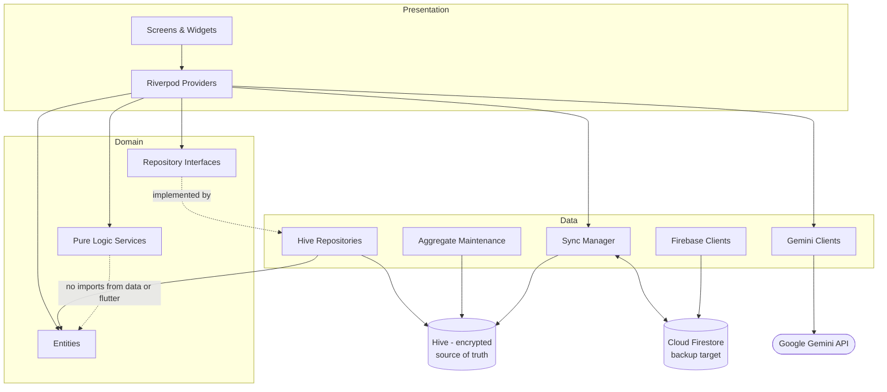
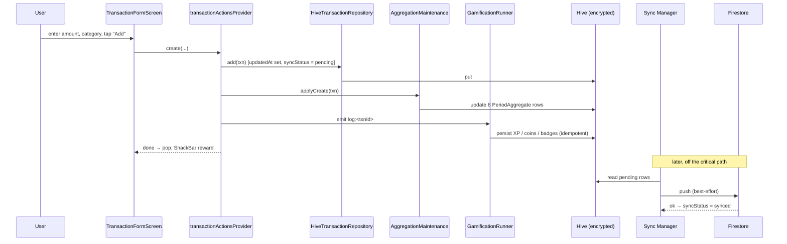

# Spendly — Architecture

This is the engineering companion to §3.3 of the CP2 report. It describes the
three layers, the six core components, how data flows, and why the app is
offline-first.

---

## 1. The one rule everything else follows

> **Hive is the source of truth. Firestore is a sync target, not a data source.**

Every core read and write hits the local encrypted Hive database first. Firestore
receives an opportunistic background copy and is only read once — to restore a
fresh install. No screen subscribes to a Firestore stream. No feature on the
critical path waits on connectivity. The only two exceptions are the AI features
(receipt scan, advice), which need the network by nature and degrade gracefully
without it.

---

## 2. Layers

```
┌───────────────────────────────────────────────────────────────┐
│  PRESENTATION   Flutter screens + widgets, Riverpod providers  │
│                 no business rules, no storage calls            │
├───────────────────────────────────────────────────────────────┤
│  DOMAIN         entities (plain Dart) · repository interfaces  │
│                 pure logic services · typed exceptions        │
│                 imports NOTHING from data/ or Flutter          │
├───────────────────────────────────────────────────────────────┤
│  DATA           Hive boxes + adapters (local, authoritative)   │
│                 Firebase + Gemini clients (remote)             │
│                 repository implementations · Sync Manager      │
└───────────────────────────────────────────────────────────────┘
        dependencies point INWARD ↑ only
```

- **`domain/` has zero imports from `data/` or `package:flutter`.** It is plain
  Dart. This is what makes the maintainability requirement real — the storage,
  AI and gamification pieces each sit behind an interface and can be swapped
  without touching the others.
- **Pure logic services take their inputs as parameters**, including the current
  time (`now`). They never call `DateTime.now()` internally, so every rule is
  deterministically testable.
- **Repositories throw typed exceptions** (`StorageException`, `AuthException`,
  …), never return `Result<T>` (decided Phase 4.1).

### Layer dependency graph



---

## 3. The six core components

| # | Component | Where it lives | Responsibility |
|---|---|---|---|
| 1 | **Transaction Manager** | `data/repositories/hive_transaction_repository.dart` + `presentation/providers/transaction_providers.dart` | create / edit / soft-delete / categorise transactions; every mutation bumps `updatedAt`, sets `syncStatus = pending`, and updates the aggregate cache |
| 2 | **Receipt Scanner Module** | `data/local/receipt_image_processor.dart` + `data/remote/gemini_client.dart` + `presentation/screens/receipt_scan_screen.dart` | capture → compress → Gemini → parse JSON (`domain/services/receipt_json_parser.dart`) → hand to the confirmation form. Image deleted after processing. Never auto-saves. |
| 3 | **Budget Manager** | `domain/services/budget_evaluator.dart` (pure) | evaluate spend against limits from cached aggregates; produce `safe / approaching / exceeded` states |
| 4 | **Gamification Engine** | `domain/services/gamification_engine.dart` + `gamification_rules.dart` + `badge_rules.dart` (pure) | XP, coins, level, badges and streaks from behavioural events; idempotent + reversible via `recentEventIds`; rewards budgeting, never engagement |
| 5 | **Advice Generator** | `data/repositories/advice_coordinator.dart` + `data/remote/gemini_advice_client.dart` + `domain/services/advice_summary_builder.dart` | build an aggregated, rounded summary → SHA-256 it → skip if unchanged → Gemini → parse titled items → cache with timestamp |
| 6 | **Sync Manager** | `data/repositories/sync_manager.dart` + `data/remote/firestore_sync_gateway.dart` | connectivity monitoring, push pending local changes, last-write-wins reconciliation by `updatedAt`, tombstone-aware; best-effort, never blocks a local write |

Components 3 and 4 are **pure logic with no storage or UI imports** — they take
data in and return results, which is why they have the densest unit tests.

---

## 4. Data model essentials

- **Money is `int` minor units (sen)**, never `double`. Converted to display
  strings only at the UI boundary (`core/utils/money.dart`).
- **Every syncable entity carries** `id, userId, createdAt, updatedAt,
  isDeleted, syncStatus`. See CLAUDE.md §4 for full field lists.
- **Soft deletes only.** `isDeleted = true` + `updatedAt` bump. A hard delete
  can't sync — it's indistinguishable from "never existed" on another device.
- **`PeriodAggregate`** is the report/budget cache: one row per
  `(periodType, periodKey, categoryId?)`. Eight rows are touched per transaction
  (daily/weekly/monthly/yearly × {this category, all categories}). Maintained
  incrementally by `aggregation_maintenance.dart` on every create/edit/delete,
  and fully rebuildable from Settings → "Rebuild report data".

---

## 5. Data flow — adding a transaction



The user-visible path ends at "pop, SnackBar reward". Everything below the note
is asynchronous and a failure there never affects the saved transaction.

---

## 6. Offline-first, concretely

| Scenario | Behaviour |
|---|---|
| Cold start, no network, existing session | reads session from secure storage (no Firebase call) → straight to home |
| Add / edit / delete anything | Hive write succeeds immediately; `syncStatus = pending` |
| Open any report or budget | served from `PeriodAggregate` rows — no network, no full scan |
| Gamification award | computed and persisted locally |
| Reconnect | Sync Manager drains pending rows to Firestore in the background |
| Fresh reinstall + sign in | one-time non-blocking restore from Firestore, then aggregates rebuilt locally |
| Receipt scan / AI advice offline | clear "no connection" message; manual entry always available; advice shows last cached result with its timestamp |

---

## 7. Security posture

- Hive boxes are AES-encrypted; the key is generated on first launch and stored
  in the Android Keystore (hardware-backed where available) via
  `flutter_secure_storage` — never in a Hive box, never in a file.
- All remote traffic is HTTPS (Firebase SDKs, Gemini over `package:http`).
- Gemini receives only aggregated, rounded data for advice, and only the
  receipt photo for scanning — never raw transactions, merchant names, notes or
  identity (enforced in `advice_summary_builder.dart`; visible to the user in
  Settings → "What's sent to Gemini").
- **Known limitation:** the Gemini API key ships in the APK (option B in
  CLAUDE.md §9). Mitigated with Google Cloud key restrictions; documented in the
  report. Moving to a Cloud Function proxy changes one endpoint constant.

---

## 8. Testing seams

| Seam | Used by |
|---|---|
| `HiveStore` behind `hiveStoreProvider` | swap real encrypted Hive for a temp-dir instance (`HiveTestHarness`) |
| Repository interfaces in `domain/repositories/` | in-memory fakes for widget tests (`pumpSpendly`) |
| `clockProvider` / `localTimeProvider` | pin time in every test |
| `ConnectivityMonitor` interface | `FakeConnectivityMonitor(startOnline:)` |
| `RemoteSyncGateway` interface | fake gateway for sync-reconciliation tests |
| pure services take `now` + data as params | direct unit tests, no mocking |

~380 unit/widget/journey tests plus a Dart-VM performance scaling test and an
on-device integration timing test. Evidence: [TEST_RESULTS.md](TEST_RESULTS.md).
